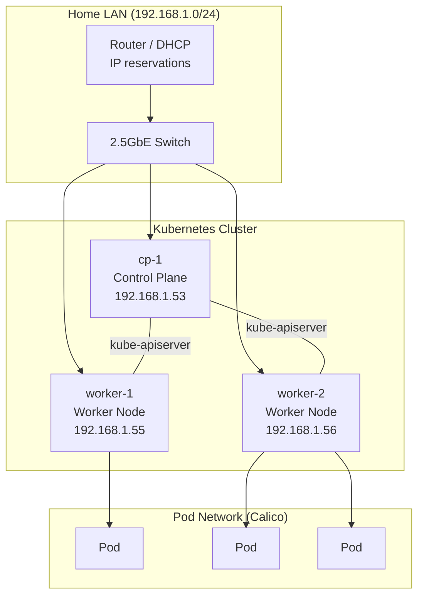

# Kubernetes Home Lab

This repository documents the design, installation and operation of a
bare-metal Kubernetes cluster built at home using kubeadm.

Documentation, which is also a work in progress and a bit lower priority for now,
is available here: https://kaninda.github.io/kubernetes-home-lab/.

## Goals
- Build a production-like Kubernetes cluster
- Practice CKA / CKAD concepts
- Document each step clearly and reproducibly

## Cluster Overview
- Kubernetes version: 1.34.x
- OS: Ubuntu Server
- Runtime: containerd
- CNI: Calico
- Installation method: kubeadm



## Hardware
| Node | Role | CPU | RAM | Storage |
|-----|-----|-----|-----|---------|
| cp-1 | Control Plane | Ryzen 5 3500U | 16 GB | 512 GB SSD |
| worker-1 | Worker | Ryzen 5 5500U | 32 GB | 500 GB SSD |
| worker-2 | Worker | Ryzen 5 5500U | 32 GB | 500 GB SSD |

## Network
- LAN: 192.168.1.0/24
- Pod CIDR: 10.244.0.0/16
- All nodes connected via 2.5GbE switch

## Documentation
Step-by-step documentation is available in the `docs/` directory.

## Status
🚧 Work in progress

## Run mkdocs in local 

```bash
python -m mkdocs serve
```
## Deploy mkdocs to github page
```bash
python -m mkdocs gh-deploy
```
