# CNI Installation (Calico)

This section describes how to install Calico as the Container Network Interface (CNI)
for the Kubernetes Home Lab.

Calico is responsible for:
- Pod-to-Pod networking across nodes
- Pod IP address allocation
- Network routing and encapsulation
- Network policy enforcement (optional, later)
---

## Prerequisites

Before installing Calico, ensure that:

- the Kubernetes control plane is initialized
- kubectl access is configured
- all nodes are in NotReady state (expected before CNI installation)

### Verify current node status:
```bash
kubectl get nodes
```
Expected output:

- Control plane node is present
- Status is NotReady

--- 
## Network design assumptions

This lab uses the following network ranges:

| Network type | CIDR |
|------|--|
| Home LAN | 192.168.1.0/24 |
| Pod Network     | 10.244.0.0/16 | 

⚠️ The Pod Network CIDR must match the value provided during kubeadm init.
---
## Why Calico

Calico was selected for this home lab because it provides:

- Native Kubernetes networking (no overlay requirement)
- High performance and low overhead
- Optional encapsulation (IP-in-IP or VXLAN)
- First-class support for NetworkPolicies
- Production-grade behavior while remaining simple to operate
---

## Logical Pod Network topology (Calico)

This diagram represents the **logical networking model** once Calico is installed.

- Each node is assigned a Pod CIDR
- Pods receive IPs from the Pod Network range
- Calico routes Pod traffic between nodes
- No NAT is required between Pods

{ width="80%" }

---

## Install Calico
Calico is installed by applying the official manifest.

### Download the Calico manifest
``` bash
curl -O https://raw.githubusercontent.com/projectcalico/calico/v3.27.3/manifests/calico.yaml
```
###
(Optional) Review the manifest:
``` bash
less calico.yaml
```
---
## Apply the manifest
```bash
kubectl apply -f calico.yaml
```
This will deploy:

- calico-node (DaemonSet)
- calico-kube-controllers
- required CRDs and RBAC rules
---

## Verify Calico deployment

### Check Calico pods:
```bash
kubectl get pods -n kube-system
```
### Expected output:

- calico-node pods running on all nodes
- calico-kube-controllers running

### Example:
```bash
calico-node-xxxxx            Running
calico-kube-controllers      Running
```
---
## Verify node readiness
Once Calico is running, nodes should transition to Ready.
```bash
kubectl get nodes
```
Expected output:

- control plane node is Ready

---
## Verify Pod networking
### Deploy a simple test Pod:
```bash
kubectl run test-pod --image=busybox --restart=Never -- sleep 3600
```
###Verify Pod status:
```bash
kubectl get pods
```
### Expected:

- Pod is Running

### (Optional) Check Pod IP:
```bash
kubectl get pod test-pod -o wide
```
---
## Cleanup test Pod
```bash
kubectl delete pod test-pod
```
---
## Result

At this stage:

- Calico is installed and operational
- Pod networking is functional
- The cluster is ready to accept worker nodes


