# Kubernetes Home Lab

Welcome 👋

This site documents the design and installation of a **bare-metal Kubernetes cluster**
built at home using **kubeadm**.

The goal of this project is to:

- learn Kubernetes internals
- build a realistic bare-metal cluster
- document every step for reproducibility

Start with the **Overview** section to understand the cluster design and scope.

{ width="40%" }

