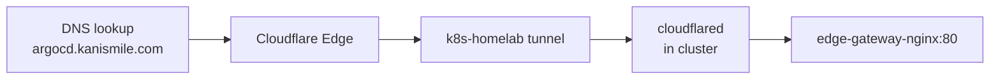

# DNS & Domain Setup

This section describes how DNS is configured for the Kubernetes Home Lab
using **Cloudflare** as the authoritative DNS provider.

All subdomains are resolved by Cloudflare and routed through the
**Cloudflare Tunnel** — no public IP is exposed on the cluster.

---

## Overview

{ width="100%" }

- **Domain** : `kanismile.com`
- **DNS provider** : Cloudflare (Full setup)
- **All traffic is proxied** through Cloudflare — the cluster IP is never exposed

---

## Cloudflare Setup

### DNS Management

`kanismile.com` is fully managed by Cloudflare.
The domain nameservers are delegated to Cloudflare:

| Type | Value |
|------|-------|
| NS | `casey.ns.cloudflare.com` |
| NS | `chan.ns.cloudflare.com` |

!!! info
**DNS Setup: Full** means Cloudflare manages both DNS resolution
and proxying for all records.

---

### DNS Records

| Type | Name | Content | Proxy |
|------|------|---------|-------|
| A | `kanismile.com` | `213.55.246.66` | ✅ Proxied |
| Tunnel | `argocd` | `k8s-homelab` | ✅ Proxied |
| Tunnel | `grafana` | `k8s-homelab` | ✅ Proxied |
| Tunnel | `prometheus` | `k8s-homelab` | ✅ Proxied |
| Tunnel | `alertmanager` | `k8s-homelab` | ✅ Proxied |
| CNAME | `www` | `kanismile.com` | ✅ Proxied |

!!! note
**Tunnel records are created automatically** by Cloudflare when a public hostname
is added to a tunnel in the Zero Trust dashboard.
No manual DNS entry is needed when adding a new service.

---

## How Tunnel Records Work

When a hostname is added to the `k8s-homelab` tunnel in the Zero Trust dashboard,
Cloudflare automatically creates a `Tunnel` DNS record pointing to the tunnel.

This means:

- `argocd.kanismile.com` resolves to the Cloudflare edge
- Cloudflare routes the request through the tunnel to the cluster
- **No IP address is ever exposed** in the DNS records



---

## Adding a New Service

To expose a new service, three steps are required:

**1. Create the HTTPRoute** in the cluster namespace:

```yaml
apiVersion: gateway.networking.k8s.io/v1
kind: HTTPRoute
metadata:
  name: my-service
  namespace: my-namespace
spec:
  parentRefs:
    - name: edge-gateway
      namespace: nginx-gateway
  hostnames:
    - my-service.kanismile.com
  rules:
    - matches:
        - path:
            type: PathPrefix
            value: /
      backendRefs:
        - name: my-service
          port: 80
```

**2. Add the hostname in the Cloudflare Zero Trust dashboard:**

```
Zero Trust → Networks → Tunnels → k8s-homelab → Public Hostnames → Add
  Subdomain : my-service
  Domain    : kanismile.com
  Service   : http://edge-gateway-nginx.nginx-gateway.svc.cluster.local:80
```

**3. Cloudflare automatically creates the Tunnel DNS record.**

The service is immediately accessible at `https://my-service.kanismile.com`.

!!! tip
TLS is handled automatically by Cloudflare — no certificate management
is needed on the cluster side.

---

## Design Decisions

- **Cloudflare as full DNS provider** — simplifies management, no external registrar delegation needed
- **All records proxied** — hides the cluster behind Cloudflare, enabling DDoS protection and TLS termination
- **Tunnel records over CNAME/A** — automatic creation when adding hostnames to the tunnel, no manual DNS management
- **Single tunnel for all subdomains** — one `k8s-homelab` tunnel handles all services

---
