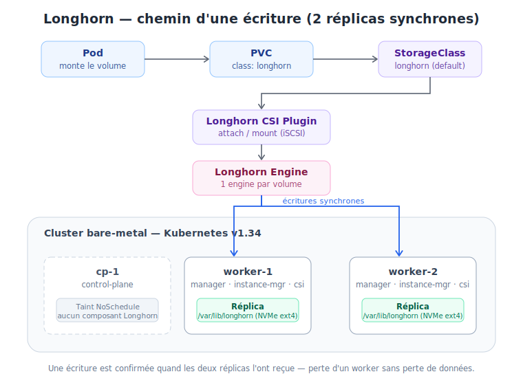

# Longhorn — Stockage répliqué du cluster bare-metal

!!! info "Résumé"
    Longhorn **1.12.0** installé via Helm le **18/07/2026** sur le cluster bare-metal
    (`cp-1` / `worker-1` / `worker-2`, Kubernetes v1.34.3).
    StorageClass `longhorn` par défaut, **2 réplicas** par volume, données sur les workers uniquement.

## Architecture
{ width="100%" }

- Un PVC sans `storageClassName` tombe sur la StorageClass `longhorn` (classe par défaut).
- Chaque volume est répliqué en **2 copies synchrones**, une sur `worker-1`, une sur `worker-2`.
- `cp-1` (control-plane, taint `NoSchedule`) n'héberge **ni réplica ni composant Longhorn** —
  seuls les workers font tourner `longhorn-manager`, `instance-manager`, `engine-image` et `longhorn-csi-plugin` (2 exemplaires de chaque).
- Données hôte : `/var/lib/longhorn` sur le NVMe de chaque worker (ext4, ~440 Go libres/nœud).

Pourquoi 2 réplicas et pas 3 : avec le taint sur `cp-1`, seuls 2 nœuds peuvent stocker.
Un `defaultReplicaCount: 3` laisserait les volumes en état dégradé permanent.

## Prérequis appliqués (workers uniquement pour les modules, les 3 nœuds pour le reste)

Sur **chaque nœud** :

```bash
sudo apt-get install -y open-iscsi nfs-common
sudo systemctl enable --now iscsid
```

Sur **worker-1 et worker-2** :

```bash
# Modules noyau requis (RWX + volumes chiffrés)
sudo modprobe nfs && sudo modprobe dm_crypt
cat <<'EOF' | sudo tee /etc/modules-load.d/longhorn.conf
nfs
dm_crypt
EOF

# multipathd désactivé : il capture les devices Longhorn (piège bare-metal classique)
sudo systemctl disable --now multipathd multipathd.socket
```

## Vérification préalable — `longhornctl` (pas environment_check.sh)

!!! warning "Piège rencontré"
    Le script `environment_check.sh` documenté un peu partout est **déprécié et retiré**
    des versions récentes → 404 sur les URL `v1.12.x`. Utiliser la CLI `longhornctl`.

Depuis le poste d'admin (macOS Apple Silicon) :

```bash
curl -sSfL -o longhornctl \
  https://github.com/longhorn/cli/releases/download/v1.12.0/longhornctl-darwin-arm64
chmod +x longhornctl && sudo mv longhornctl /usr/local/bin/
```

Deux subtilités rencontrées :

1. `longhornctl` **ne lit pas** `~/.kube/config` par défaut → exporter `KUBECONFIG`
   (pérennisé dans `~/.zshrc` : `export KUBECONFIG=$HOME/.kube/config`).
2. Le preflight déploie ses pods dans `longhorn-system` → **créer le namespace avant** :

```bash
kubectl create namespace longhorn-system
longhornctl check preflight
```

Résultat attendu : uniquement des `info` sur worker-1 et worker-2.
`cp-1` n'apparaît pas dans le rapport (taint control-plane) — c'est normal.

## Installation Helm

`longhorn-values.yaml` :

```yaml
defaultSettings:
  defaultReplicaCount: 2
  storageMinimalAvailablePercentage: 15
  defaultDataPath: /var/lib/longhorn

persistence:
  defaultClass: true          # StorageClass "longhorn" devient la classe par défaut
  defaultClassReplicaCount: 2
```

```bash
helm repo add longhorn https://charts.longhorn.io
helm repo update
helm install longhorn longhorn/longhorn \
  --namespace longhorn-system \
  --version 1.12.0 \
  -f longhorn-values.yaml
```

Notes post-install :

- Un restart unique de `longhorn-manager` au premier démarrage est normal
  (initialisation CRDs/webhook).
- Vérifier `kubectl get storageclass` : `longhorn` doit être marquée `(default)`
  et être **la seule** classe par défaut.

## Validation

```bash
kubectl apply -f - <<'EOF'
apiVersion: v1
kind: PersistentVolumeClaim
metadata:
  name: test-longhorn
spec:
  accessModes: ["ReadWriteOnce"]
  storageClassName: longhorn
  resources:
    requests:
      storage: 1Gi
EOF
kubectl get pvc test-longhorn   # -> Bound
kubectl delete pvc test-longhorn
```

## Accès à l'UI

Port-forward uniquement pour l'instant (l'UI n'a **aucune auth intégrée**) :

```bash
kubectl -n longhorn-system port-forward svc/longhorn-frontend 8080:80
# -> http://localhost:8080
```

## Reste à faire

- [ ] **Backup target** (S3 ou NFS) — *prioritaire avant de mettre de vraies données* :
      les réplicas protègent d'une panne de nœud, pas d'une suppression accidentelle.
- [ ] Exposer l'UI via NGINX Gateway Fabric (HTTPRoute) avec auth en amont.
- [ ] `ServiceMonitor` Prometheus + dashboard Grafana (métriques Longhorn natives).
- [ ] Éventuelle StorageClass `longhorn-single` (`numberOfReplicas: "1"`) pour données jetables.

## Références

- Chart : `longhorn/longhorn` 1.12.0 — <https://charts.longhorn.io>
- CLI : <https://github.com/longhorn/cli>
- Multipath : <https://longhorn.io/kb/troubleshooting-volume-with-multipath/>
