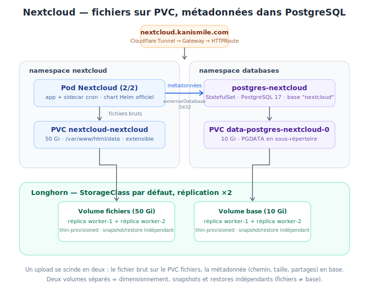

# Nextcloud — Cloud de fichiers auto-hébergé

!!! info "Résumé"
    Nextcloud **34.0.1** (chart Helm officiel) déployé le **19/07/2026**, accessible sur
    <https://nextcloud.kanismile.com> (auth Nextcloud intégrée).
    Fichiers sur un PVC Longhorn **50 Gi**, métadonnées dans une instance
    **PostgreSQL 17 dédiée** (`postgres-nextcloud`, namespace `databases`, PVC 10 Gi).
    Tous les volumes répliqués ×2 par Longhorn.

## Architecture

{ width="100%" }

Deux namespaces, deux PVC, une connexion réseau :

- **`databases`** : StatefulSet `postgres-nextcloud` (PostgreSQL 17-alpine) + Service
  headless + PVC Longhorn 10 Gi. Instance **dédiée** à Nextcloud — le pattern retenu est
  *une instance par application* (upgrades, pannes et restores isolés par app ; en K8s,
  une instance de plus ne coûte que ~30 lignes de YAML et 256 Mi de RAM). Une future app
  aura sa propre instance `postgres-<app>` dans ce même namespace.
- **`nextcloud`** : le chart Helm (Deployment + CronJob) + PVC Longhorn 50 Gi pour les
  fichiers utilisateurs.

Trajet d'un upload : le fichier brut descend sur le PVC `nextcloud-nextcloud` ;
la métadonnée (propriétaire, chemin, taille, partages) part par le réseau vers
`postgres-nextcloud.databases.svc.cluster.local:5432` (bloc `externalDatabase` du chart).
Nextcloud sépare toujours ces deux mondes : le PVC est la bibliothèque, Postgres le
catalogue — la navigation et la sync ne scannent jamais le disque, elles interrogent la base.

Fichiers du repo :

```
nextcloud/
├── postgres-nextcloud.yaml          # Namespace databases + Service + StatefulSet
├── postgres-nextcloud-secret.yaml   # (gitignoré) credentials Postgres
├── nextcloud-values.yaml            # values du chart
└── nextcloud-secrets.yaml           # (gitignoré) admin + connexion DB
httpRoute/
└── nextcloud-httproute.yaml
```

## PostgreSQL dédié

Déploiement déclaratif (`nextcloud/postgres-nextcloud.yaml`) : StatefulSet mono-réplica,
`postgres:17-alpine`, base `nextcloud` créée automatiquement au premier démarrage via
`POSTGRES_DB`, probes `pg_isready`, PVC 10 Gi sur la StorageClass par défaut.

!!! warning "Piège : PGDATA et lost+found"
    Un volume Longhorn fraîchement formaté en ext4 contient `lost+found`, et `initdb`
    refuse un répertoire non vide → CrashLoopBackOff au premier démarrage.
    Parade (dans le manifest) : `PGDATA=/var/lib/postgresql/data/pgdata` — un
    **sous-répertoire** du point de montage.

```bash
kubectl apply -f nextcloud/postgres-nextcloud.yaml
kubectl apply -f nextcloud/postgres-nextcloud-secret.yaml
kubectl -n databases exec -it postgres-nextcloud-0 -- psql -U nextcloud -d nextcloud -c '\l'
```

## Secrets

Trois Secrets, tous **déclaratifs mais gitignorés** (`stringData` = valeurs en clair,
encodées par l'API server) :

| Secret | Namespace | Rôle |
|---|---|---|
| `postgres-nextcloud-credentials` | `databases` | password de l'instance Postgres |
| `nextcloud-db` | `nextcloud` | connexion DB côté Nextcloud — **même password** que ci-dessus (un Secret n'est pas lisible entre namespaces, il est dupliqué) |
| `nextcloud-admin` | `nextcloud` | compte admin initial de l'interface web |

!!! warning "Deux pièges rencontrés sur les Secrets"
    1. **Mot de passe vide** : un `password: ""` dans `nextcloud-admin` fait boucler
       l'installeur (`Set an admin password. / Retrying install...`). Vérifier après apply :
       `kubectl -n nextcloud get secret nextcloud-admin -o jsonpath='{.data.password}' | base64 -d`
    2. **Caractères spéciaux YAML** : un mot de passe commençant par `@`, `*`, `&`, `%`…
       casse le parsing (`found character that cannot start any token`).
       **Toujours quoter les valeurs** : `password: '@WG26...'`

Le base64 des Secrets n'est **pas** du chiffrement — d'où le `.gitignore`. À terme :
Sealed Secrets ou SOPS pour les versionner proprement (prérequis GitOps/ArgoCD).

## Installation Helm

Points clés de `nextcloud/nextcloud-values.yaml` :

- `internalDatabase.enabled: false` + bloc `externalDatabase` → l'instance dédiée.
- `nextcloud.existingSecret` / `externalDatabase.existingSecret` → aucun credential
  dans les values, versionnables tels quels.
- `configs.proxy.config.php` : **indispensable derrière Cloudflare Tunnel** —
  TLS terminé en amont, le pod voit du HTTP pur. Sans `overwriteprotocol: https`,
  liens générés en `http://` et boucles de redirection.
- `cronjob.enabled: true` → un conteneur sidecar cron (le pod est donc `2/2`).
- `startupProbe` généreuse (30×10 s) : le premier boot installe ~100 tables.

```bash
helm repo add nextcloud https://nextcloud.github.io/helm/
helm install nextcloud nextcloud/nextcloud -n nextcloud --create-namespace \
  -f nextcloud/nextcloud-values.yaml
kubectl -n nextcloud logs -f deploy/nextcloud -c nextcloud   # suivre le 1er boot
```

Premier boot réussi = cette séquence dans les logs :
`Initializing nextcloud … → New nextcloud instance → Starting nextcloud installation
→ Nextcloud was successfully installed → Setting trusted domains → Apache resuming normal operations`

!!! danger "Piège majeur : l'installation ratée laisse un PVC zombie"
    L'entrypoint décide de lancer l'installeur en comparant le **marqueur de version
    sur le volume** avec celui de l'image — pas en regardant la base. Si la première
    installation échoue (ex. mot de passe admin vide) :
    fichiers copiés sur le PVC + `config.php` vide/partiel + base jamais peuplée
    → aux redémarrages suivants, l'entrypoint croit l'instance installée et
    **ne retente jamais**. Symptômes trompeurs : pod `Running`, probes `status.php`
    en 200, mais `occ status` → `installed: false` et page web
    « Configuration was not read or initialized correctly ».
    **Remède** : corriger la cause, puis `helm uninstall` + **suppression du PVC**
    + `helm install`. Un simple restart ne suffit jamais.

## Exposition

Auth **intégrée** à Nextcloud → pas de Cloudflare Access nécessaire (contrairement à
l'UI Longhorn). Deux pièces, détail des routes dans la page Cloudflare Tunnel :

1. Route du tunnel `k8s-homelab` : `nextcloud.kanismile.com` →
   `http://edge-gateway-nginx.nginx-gateway.svc.cluster.local:80`
2. `httpRoute/nextcloud-httproute.yaml` : hostname → service `nextcloud:8080`

## Validation

```bash
kubectl -n nextcloud get pods                     # 2/2 Running (app + cron)
kubectl -n nextcloud exec deploy/nextcloud -c nextcloud -- php occ status   # installed: true
kubectl -n databases exec -it postgres-nextcloud-0 -- \
  psql -U nextcloud -d nextcloud -c '\dt'         # tables oc_*
```

Test de bout en bout : upload d'un fichier via l'interface, puis :

```bash
kubectl -n databases exec -it postgres-nextcloud-0 -- \
  psql -U nextcloud -d nextcloud -c \
  "SELECT path, size FROM oc_filecache ORDER BY fileid DESC LIMIT 5;"
```

Le fichier apparaît dans `oc_filecache` (métadonnées) et sur le PVC
(`/var/www/html/data/<user>/files/`) — les deux moitiés du trajet d'upload.

## Reste à faire

- [ ] **Backups** : dépend de la backup target Longhorn (voir page Longhorn) —
      les deux PVC (fichiers + base) doivent y être couverts par des Recurring Jobs.
- [ ] Redis pour le verrouillage de fichiers et le cache (recommandé au-delà d'un
      utilisateur ; le chart le propose en sous-chart).
- [ ] Stockage de masse : NAS en External Storage (app Nextcloud) pour les gros
      médias froids — le PVC 50 Gi reste pour l'app et les données chaudes.
- [ ] Page « databases » dédiée si le namespace accueille d'autres instances.

## Références

- Chart : <https://nextcloud.github.io/helm/>
- Image : `nextcloud:34-apache` (via chart) · `postgres:17-alpine`
- Reverse proxy : <https://docs.nextcloud.com/server/latest/admin_manual/configuration_server/reverse_proxy_configuration.html>
